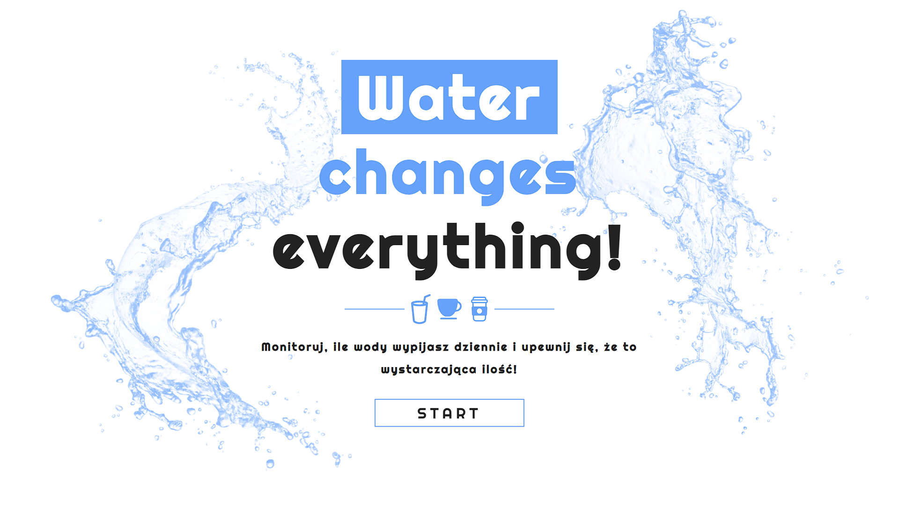
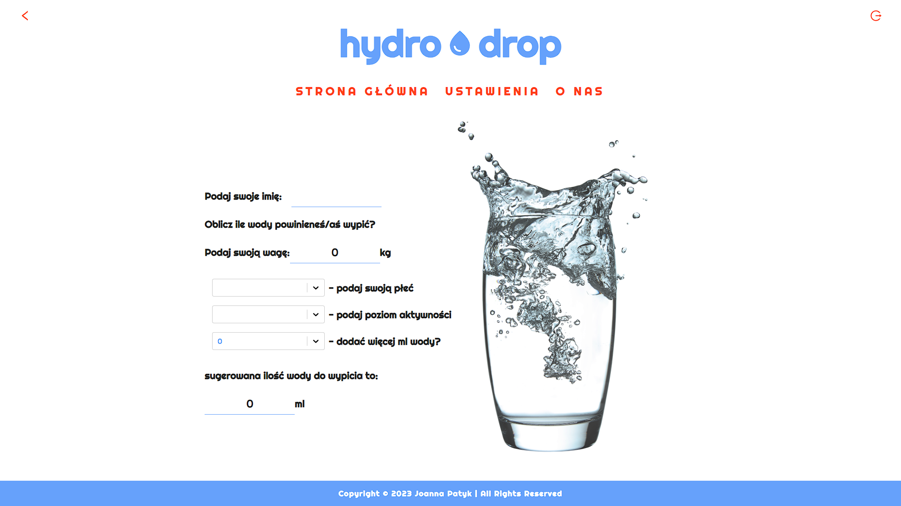

# Hydrodrop 💧

**Hydrodrop** is a simple application that allows users to track the amount of water they drink throughout the day.

After starting the app, the main window displays a glass of water. The user can click on one of three drop sizes - 250ml, 500ml, or 1000ml - to mark the amount of water they drink, which fills up the large glass.

To set a daily goal for the amount of water you want to drink, you can go to the settings page. The app will display your progress towards that goal, allowing you to track how much water you have consumed throughout the day.

In the future, I also plan to add a feature that will allow you to view a history of the amount of water you drank on previous days. This will help
This project was bootstrapped with [Create React App](https://github.com/facebook/create-react-app).

I use **Local Storage** to save the recorded progress of drinking water and settings.

## Technologies

The application was built using the following technologies:

-   `React`,
-   `Styled-components`,
-   `CSS`.

## Installation

To install **Hydrodrop**, follow these steps:

-   Clone the hydrodrop-app repository to your computer.
-   Open a terminal and navigate to the hydrodrop-app directory.
-   Install dependencies by running `npm install`.
-   Start the app by running `npm start`.
